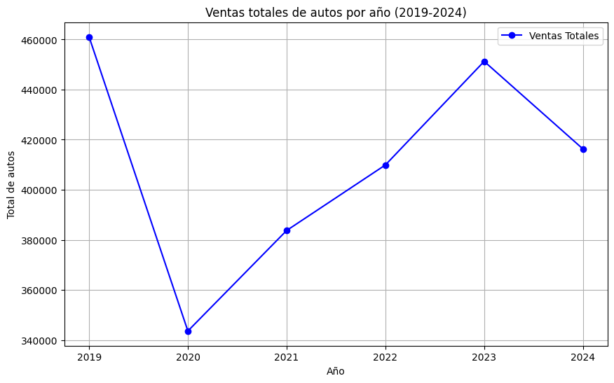

# Analisis Matriculacion Vehiculos Argentina
Este informe presenta un análisis descriptivo de las ventas de autos en Argentina entre 2019 y 2024, basado en datos de inscripciones de vehículos.

Informe: Análisis de Ventas de Autos y Perfil de Titulares (2019-2024)

Introducción

Este informe presenta un análisis descriptivo de las ventas de autos en Argentina entre 2019 y 2024, basado en datos de inscripciones de vehículos. Se examinan las ventas totales por año, las marcas y tipos de autos más vendidos, el origen de los vehículos, el tipo de uso, la distribución geográfica de los titulares, y el perfil demográfico de los titulares (género y edad). El análisis se apoya en tablas y gráficos para facilitar la interpretación de los datos.

* * * * *

1\. Ventas Totales de Autos por Año (2019-2024)

-   Descripción: Este gráfico de líneas muestra la evolución de las ventas totales de autos entre 2019 y 2024.

-   Datos:

    -   2019: ~460,000 unidades.

    -   2020: ~340,000 unidades (mínimo).

    -   2021: ~390,000 unidades.

    -   2022: ~460,000 unidades (máximo).

    -   2023: ~420,000 unidades.

    -   2024: ~420,000 unidades.

Análisis:

-   Las ventas de autos experimentaron una caída significativa en 2020, probablemente debido a la pandemia de COVID-19, que afectó la economía y la demanda de vehículos.

-   A partir de 2021, se observa una recuperación, alcanzando un pico en 2022 con ventas similares a las de 2019.

-   Entre 2023 y 2024, las ventas se estabilizan en torno a 420,000 unidades, mostrando una ligera disminución respecto al pico de 2022.

Conclusión:

La tendencia general indica una recuperación post-pandemia, y la estabilización en 2023-2024 sugiere que el mercado ha alcanzado un nivel sostenible tras los desafíos de 2020. Este comportamiento puede ser una señal positiva para el futuro, especialmente para la venta de autos cero kilómetro, ya que la estabilidad podría atraer a más consumidores que buscan renovar sus vehículos en un contexto económico más predecible. Además, las políticas de incentivo a la producción local y los acuerdos del Mercosur podrían impulsar un crecimiento sostenido en los próximos años.

* * * * *

2\. Ventas de las Marcas Más Populares por Año (2019-2024)

-   Descripción: Este gráfico de líneas múltiples muestra las ventas de las 10 marcas más populares (Toyota, Volkswagen, Fiat, Renault, Ford, Chevrolet, Peugeot, Nissan, Citroën, Jeep) a lo largo de los años.

-   Datos:

    -   Toyota lidera consistentemente, con un aumento notable de 2019 (70,000) a 2024 (90,000).

    -   Volkswagen y Fiat mantienen posiciones fuertes, con ventas estables entre 50,000 y 70,000 unidades.

    -   Marcas como Ford y Chevrolet muestran una disminución progresiva.

    -   Jeep y Citroën tienen ventas más bajas, pero Jeep muestra un crecimiento leve hacia 2024.

Análisis:

-   Toyota se consolida como la marca líder, con un crecimiento sostenido, lo que podría indicar una preferencia por su oferta de modelos (especialmente pick-ups y SUVs).

-   Volkswagen y Fiat mantienen una presencia sólida, probablemente debido a su amplia gama de modelos accesibles.

-   Marcas como Ford y Chevrolet pierden terreno, lo que podría estar relacionado con cambios en su estrategia de mercado o menor competitividad en precio y oferta.

-   Jeep muestra un crecimiento leve, posiblemente impulsado por la demanda de SUVs.

Conclusión:

El mercado está dominado por Toyota, Volkswagen y Fiat, mientras que otras marcas enfrentan desafíos para mantener su cuota. Las marcas con crecimiento (como Toyota y Jeep) podrían estar capitalizando tendencias hacia vehículos más robustos y versátiles.

* * * * *

3\. Tipos de Automotores Más Vendidos

-   Descripción: Este gráfico de barras horizontales muestra el recuento de unidades vendidas por tipo de automotor (sedán 5 puertas, sedán 4 puertas, pick-up, rural 5 puertas, etc.) para cada año.

-   Datos:

    -   Sedán 5 puertas es el tipo más vendido en todos los años, con un pico en 2019 (200,000 unidades) y una disminución hacia 2024 (150,000).

    -   Pick-ups y rurales 5 puertas también tienen ventas significativas, pero menores que los sedanes.

    -   Otros tipos (furgón, tractor) tienen ventas mucho más bajas.

Análisis:

-   Los sedanes 5 puertas dominan el mercado, aunque su popularidad ha disminuido ligeramente con el tiempo, lo que podría reflejar un cambio en las preferencias hacia otros tipos de vehículos.

-   Las pick-ups y rurales 5 puertas mantienen una demanda constante, probablemente debido a su uso en actividades comerciales y rurales.

-   Tipos menos comunes, como tractores y semirremolques, tienen un mercado mucho más pequeño, lo que es esperable dado su uso especializado.

Conclusión:

El mercado argentino sigue prefiriendo los sedanes 5 puertas, pero hay una demanda sostenida por pick-ups y rurales, lo que sugiere una diversidad de necesidades entre los consumidores (uso urbano vs. rural/comercial).

* * * * *

4\. Recuento de Marcas Más Vendidas por Año

-   Descripción: Este gráfico de barras horizontales muestra las ventas de las marcas más populares por año, con barras separadas para cada año.

-   Datos:

    -   Toyota y Volkswagen lideran consistentemente, con Toyota alcanzando ~100,000 unidades en 2024.

    -   Fiat, Renault y Peugeot tienen ventas estables, entre 40,000 y 60,000 unidades.

    -   Marcas como Mercedes-Benz y Honda tienen ventas mucho más bajas.

Análisis:

-   Este gráfico confirma las tendencias observadas en el gráfico de líneas: Toyota y Volkswagen son las marcas más fuertes, con Toyota mostrando un crecimiento notable.

-   Marcas de lujo como Mercedes-Benz tienen un mercado más pequeño, lo que es esperable dado su precio más alto.

-   La estabilidad de marcas como Fiat y Renault sugiere que tienen una base de clientes leales.

Conclusión:

Toyota y Volkswagen son las marcas más competitivas, mientras que marcas de lujo y otras menos populares tienen un nicho más reducido. Esto refleja un mercado donde los consumidores priorizan precio y confiabilidad.

* * * * *

5\. Distribución Geográfica de los Titulares

-   Descripción: Este gráfico de torta muestra la distribución de los titulares por provincia.

-   Datos:

    -   Buenos Aires: 28.35%

    -   Ciudad Autónoma de Bs. As.: 18.54%

    -   Córdoba: 10.48%

    -   Santa Fe: 9.29%

    -   Mendoza: 3.65%

    -   Otras provincias: <3% cada una.

Análisis:

-   Buenos Aires y la Ciudad Autónoma de Buenos Aires concentran casi la mitad de los titulares (46.89%), lo que refleja la alta densidad poblacional y actividad económica de estas áreas.

-   Provincias como Córdoba y Santa Fe también tienen una presencia significativa, probablemente debido a su importancia económica y población.

-   Provincias más pequeñas tienen un porcentaje mucho menor, lo que es consistente con su menor población.

Conclusión:

La mayoría de los titulares se concentran en las áreas más pobladas y económicamente activas de Argentina, lo que sugiere que las ventas de autos están fuertemente influenciadas por la urbanización y el poder adquisitivo de estas regiones.

* * * * *

6\. Perfil Demográfico de los Titulares

-   Descripción: Este gráfico de torta muestra la distribución de los titulares por género.

-   Datos:

    -   Masculino: 48.51%

    -   Femenino: 28.05%

    -   No aplica: 23.44%

Análisis:

-   Los hombres representan casi la mitad de los titulares, mientras que las mujeres constituyen un 28.05%.

-   Un 23.44% de los registros tienen género "No aplica", lo que podría incluir personas jurídicas u otros casos donde el género no es relevante.

Conclusión:

Aunque los hombres predominan entre los titulares, las mujeres tienen una presencia significativa, lo que indica una participación notable en la compra de autos. La categoría "No aplica" sugiere que una parte importante de los titulares podrían ser empresas u otras entidades.

* * * * *

6.2. Recuento de Tipo de Persona

-   Descripción: Este gráfico de torta muestra la distribución de los titulares por tipo de persona (física o jurídica).

-   Datos:

    -   Física: 76.56%

    -   Jurídica: 23.44%

Análisis:

-   La mayoría de los titulares son personas físicas (76.56%), lo que indica que los autos son comprados principalmente por individuos.

-   Las personas jurídicas (empresas) representan un 23.44%, lo que coincide con el porcentaje de "No aplica" en el recuento de género, sugiriendo que esta categoría incluye principalmente empresas.

Conclusión:

El mercado está dominado por compradores individuales, pero las empresas también tienen una participación relevante, probablemente para flotas comerciales o uso empresarial.

* * * * *

6.3. Cantidad de Titulares por Género y Año (2019-2024)

-   Descripción: Este gráfico de barras apiladas muestra la cantidad de titulares por género (femenino y masculino) para cada año.

-   Datos:

    -   2019: ~150,000 (femenino), ~200,000 (masculino).

    -   2020: ~120,000 (femenino), ~160,000 (masculino).

    -   2021: ~130,000 (femenino), ~170,000 (masculino).

    -   2022: ~140,000 (femenino), ~190,000 (masculino).

    -   2023: ~130,000 (femenino), ~180,000 (masculino).

    -   2024: ~130,000 (femenino), ~180,000 (masculino).

Análisis:

-   La proporción entre géneros se mantiene relativamente constante, con los hombres representando una mayor cantidad de titulares en todos los años.

-   La cantidad total de titulares sigue la misma tendencia que las ventas totales, con una caída en 2020 y una recuperación en 2022.

Conclusión:

La distribución de género entre los titulares es estable, con una mayor participación masculina. Esto podría reflejar patrones culturales o económicos en la compra de autos.

* * * * *

6.4. Distribución de Edades de los Titulares por Género (2019-2024)

-   Descripción: Este histograma muestra la distribución de edades de los titulares por género (femenino y masculino).

-   Datos:

    -   Ambos géneros tienen una distribución sesgada hacia la derecha, con un pico alrededor de los 40-50 años.

    -   Las edades varían entre 18 y 100 años, con una mayor densidad entre 30 y 60 años.

Análisis:

-   La mayoría de los titulares, tanto hombres como mujeres, tienen entre 30 y 60 años, lo que sugiere que los compradores de autos suelen ser adultos en edad laboral.

-   No hay diferencias significativas en la distribución de edades entre géneros, aunque los hombres tienen una densidad ligeramente mayor en el rango de 40-50 años.

Conclusión:

Los compradores de autos son principalmente adultos de mediana edad, lo que es consistente con el poder adquisitivo y las necesidades de movilidad de este grupo demográfico. Cabe aclarar que las edades se calcularon utilizando únicamente el año de nacimiento (titular_anio_nacimiento), por lo que puede existir un margen de error de hasta un año en los cálculos, dependiendo de la fecha exacta de nacimiento de los titulares.

* * * * *

6.5. Edad Promedio de los Titulares por Género y Año (2019-2024)

-   Descripción: Este gráfico de líneas múltiples muestra la edad promedio de los titulares por género a lo largo de los años.

-   Datos:

    -   Femenino: ~47.5 años (2019) a ~47.5 años (2024).

    -   Masculino: ~50 años (2019) a ~49.5 años (2024).

Análisis:

-   La edad promedio de los titulares masculinos es ligeramente mayor que la de los femeninos en todos los años.

-   La edad promedio de ambos géneros muestra una ligera disminución con el tiempo, lo que podría indicar que los compradores más jóvenes están entrando al mercado.

Conclusión:

Los titulares masculinos tienden a ser un poco mayores que los femeninos, pero la edad promedio de ambos grupos se mantiene relativamente estable, con una leve tendencia a la baja. Como se mencionó, las edades tienen un margen de error potencial debido a que solo se utilizó el año de nacimiento para el cálculo.

* * * * *

7\. Origen de los Automotores

7.1. Recuento de Origen de Automotor

-   Descripción: Este gráfico de torta muestra la distribución de los autos por origen (nacional, importado, protocolo 21).

-   Datos:

    -   Nacional: 49.23%

    -   Protocolo 21: 41.74%

    -   Importado: 9.03%

Análisis:

-   Los autos nacionales y los del Protocolo 21 (que se refiere a vehículos importados de países del Mercosur bajo acuerdos comerciales específicos) dominan el mercado, con un 90.97% combinado.

-   Los autos importados de fuera del Mercosur representan una minoría, lo que podría estar relacionado con restricciones de importación o preferencias por vehículos producidos localmente o dentro del bloque regional.

Conclusión:

El mercado argentino favorece los autos nacionales y los del Protocolo 21, lo que refleja la importancia de la producción local y los acuerdos comerciales dentro del Mercosur en la industria automotriz.

* * * * *

7.2. Recuento de Origen de Automotor por Año

-   Descripción: Este gráfico de barras apiladas muestra la distribución de los autos por origen para cada año.

-   Datos:

    -   Nacional: Predomina en todos los años, con un pico en 2022.

    -   Protocolo 21: Aumenta progresivamente, especialmente en 2023 y 2024.

    -   Importado: Permanece bajo, con una ligera disminución.

Análisis:

-   La proporción de autos nacionales se mantiene alta, pero los del Protocolo 21 han ganado terreno, especialmente en los últimos años.

-   Los autos importados de fuera del Mercosur tienen una presencia mínima, lo que podría estar influenciado por políticas económicas o aranceles.

Conclusión:

La tendencia hacia autos del Protocolo 21 sugiere un aumento en la importación desde países del Mercosur, mientras que los autos nacionales siguen siendo la opción principal.

* * * * *

8\. Tipo de Uso de los Automotores

8.1. Porcentaje de Inscripciones de Autos Según Tipo de Uso

-   Descripción: Este gráfico de torta muestra la distribución de los autos por tipo de uso (privado, oficial, público).

-   Datos:

    -   Privado: 97.49%

    -   Oficial: 1.71%

    -   Público: 0.80%

Análisis:

-   La gran mayoría de los autos (97.49%) son de uso privado, lo que indica que el mercado está orientado principalmente a consumidores individuales.

-   Los usos oficial y público son marginales, lo que es esperable dado que estos tipos de uso suelen estar asociados a flotas gubernamentales o de transporte público.

Conclusión:

El mercado automotriz está claramente orientado al uso privado, con una participación mínima de autos destinados a uso oficial o público.

* * * * *

9\. Modelos de Automotores por Año y Origen

-   Descripción: Este gráfico de barras apiladas muestra la cantidad de autos por año de modelo y origen (nacional, importado, protocolo 21).

-   Datos:

    -   Nacional: Predomina, con un pico en 2022 (~60,000 mil).

    -   Protocolo 21: Aumenta progresivamente, especialmente en 2023 y 2024.

    -   Importado: Permanece bajo, con una ligera disminución.

Análisis:

-   Los autos nacionales tienen una presencia más fuerte en términos de modelos recientes, lo que sugiere una producción local activa.

-   Los autos del Protocolo 21 han aumentado, especialmente en los últimos años, lo que podría estar relacionado con acuerdos comerciales dentro del Mercosur que facilitan su importación.

-   Los autos importados de fuera del Mercosur tienen una participación mínima, consistente con los gráficos anteriores.

Conclusión:

La producción local sigue siendo la principal fuente de modelos recientes, pero los autos del Protocolo 21 están ganando terreno, lo que podría indicar una apertura controlada a la importación desde países del Mercosur.

* * * * *

Conclusiones Generales

1.  Ventas Totales: Las ventas de autos muestran una recuperación post-pandemia, y la estabilización en 2023-2024 sugiere un mercado que ha encontrado un equilibrio sostenible. Este escenario es prometedor para el futuro de los autos cero kilómetro, ya que la estabilidad puede generar confianza en los consumidores y fomentar la renovación de vehículos en los próximos años.

2.  Marcas y Tipos de Autos:

    -   Toyota, Volkswagen y Fiat lideran el mercado, con Toyota mostrando un crecimiento sostenido.

    -   Los sedanes 5 puertas son los más vendidos, pero las pick-ups y rurales 5 puertas tienen una demanda constante.

3.  Origen y Uso:

    -   Los autos nacionales y del Protocolo 21 (importados de países del Mercosur) dominan el mercado, con una participación mínima de autos importados de fuera del bloque.

    -   El uso privado representa el 97.49% de las inscripciones, con poca variación a lo largo de los años.

4.  Perfil de los Titulares:

    -   La mayoría de los titulares son personas físicas (76.56%), con una distribución geográfica concentrada en Buenos Aires y CABA (46.89%).

    -   Los hombres predominan entre los titulares (48.51% vs. 28.05% mujeres), pero las mujeres tienen una participación significativa.

    -   La edad promedio de los titulares es de ~47-50 años, con una distribución que se concentra entre 30 y 60 años. Cabe destacar que las edades se calcularon usando solo el año de nacimiento, lo que introduce un margen de error de hasta un año.

5.  Tendencias:

    -   Hay un aumento en la participación de autos del Protocolo 21, lo que refleja los beneficios de los acuerdos comerciales con el Mercosur.

    -   La edad promedio de los titulares muestra una leve disminución, sugiriendo que los compradores más jóvenes están entrando al mercado, lo que podría ser un indicio positivo para el futuro del sector.

6.  Perspectiva Optimista:

    -   La estabilización de las ventas y el crecimiento de marcas líderes como Toyota indican un mercado resiliente. Con la creciente participación de autos del Protocolo 21 y una base de compradores que incluye a personas más jóvenes, el futuro de los autos cero kilómetro se presenta alentador. Factores como incentivos a la producción local, acuerdos comerciales con el Mercosur, y una posible mejora en las condiciones económicas podrían impulsar un crecimiento sostenido en los próximos años.

* * * * *

Recomendaciones

1.  Estrategias de Mercado:

    -   Las marcas líderes (Toyota, Volkswagen, Fiat) deberían mantener su enfoque en modelos accesibles y versátiles (sedanes, pick-ups).

    -   Marcas con menor participación (Ford, Chevrolet) podrían necesitar ajustar su oferta para recuperar cuota de mercado.

2.  Segmentación:

    -   La concentración de titulares en Buenos Aires y CABA sugiere que las estrategias de marketing y distribución deberían priorizar estas áreas.

    -   Dado el ingreso de compradores más jóvenes, las marcas podrían desarrollar campañas que apelen a este segmento, destacando tecnología, diseño y eficiencia.

3.  Producción e Importación:

    -   La creciente participación de autos del Protocolo 21 podría ser una oportunidad para diversificar la oferta, pero las marcas nacionales deben seguir siendo competitivas en precio y calidad.

4.  Análisis Futuro:

    -   Sería útil incorporar datos económicos (inflación, PBI, tasas de interés) para entender mejor las fluctuaciones en las ventas.

    -   Un análisis más detallado por modelo de auto podría revelar preferencias específicas de los consumidores.

* * * * *

Anexo: Notas Metodológicas

-   Datos: Los datos provienen de inscripciones de autos entre 2019 y 2024, con columnas como fecha_inscripcion_inicial, automotor_marca_descripcion, titular_anio_nacimiento, titular_genero, automotor_origen, tipo_de_uso, y provincia.

-   Filtrado:

    -   Se excluyeron registros con género "NO APLICA" o "NO IDENTIFICADO" para el análisis de edades.

    -   Las edades se calcularon como Año - titular_anio_nacimiento y se filtraron para incluir solo valores entre 18 y 100 años. Dado que solo se utilizó el año de nacimiento, existe un margen de error de hasta un año en las edades.

-   Definiciones:

    -   El Protocolo 21 se refiere a la importación de autos desde países del Mercosur bajo acuerdos comerciales específicos.

-   Limitaciones:

    -   La categoría "No aplica" en género incluye personas jurídicas, lo que puede sesgar el análisis demográfico.

    -   No se incluyeron factores económicos externos que podrían explicar las fluctuaciones en las ventas.Informe: Análisis de Ventas de Autos y Perfil de Titulares (2019-2024)
